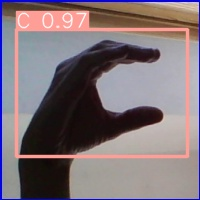
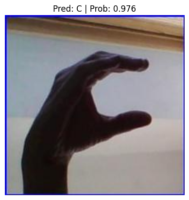

# Sign_Language_detection_using_yolo_and_vit
Final Submission of Deep Learning Course 

Link to the Google Colab: 
https://colab.research.google.com/drive/1N0tymtl9m3gNcg8ZGc6cadC-0diIUjq6#scrollTo=lFEY4hkThYI3

#**Importing the Required Libraries**


```python
import os

```


```python
import glob
```


```python
from IPython.display import Image, display
```

# **In the First Step, We need to check whether we have access to the GPU or not**


```python
!nvidia-smi
```

    Sat Apr 27 23:12:48 2024       
    +---------------------------------------------------------------------------------------+
    | NVIDIA-SMI 535.104.05             Driver Version: 535.104.05   CUDA Version: 12.2     |
    |-----------------------------------------+----------------------+----------------------+
    | GPU  Name                 Persistence-M | Bus-Id        Disp.A | Volatile Uncorr. ECC |
    | Fan  Temp   Perf          Pwr:Usage/Cap |         Memory-Usage | GPU-Util  Compute M. |
    |                                         |                      |               MIG M. |
    |=========================================+======================+======================|
    |   0  Tesla T4                       Off | 00000000:00:04.0 Off |                    0 |
    | N/A   37C    P8               9W /  70W |      0MiB / 15360MiB |      0%      Default |
    |                                         |                      |                  N/A |
    +-----------------------------------------+----------------------+----------------------+
                                                                                             
    +---------------------------------------------------------------------------------------+
    | Processes:                                                                            |
    |  GPU   GI   CI        PID   Type   Process name                            GPU Memory |
    |        ID   ID                                                             Usage      |
    |=======================================================================================|
    |  No running processes found                                                           |
    +---------------------------------------------------------------------------------------+

Checking the root location

```python
HOME = os.getcwd()
```


```python
print(HOME)
```

    /content


#**Installing Ultralytics using Pip Install**


```python
!pip install ultralytics -q
```

         ━━━━━━━━━━━━━━━━━━━━━━━━━━━━━━━━━━━━━━━━ 752.1/752.1 kB 8.0 MB/s eta 0:00:00
    [?25h

##Checking whether YOLOv8 is Installed and its working Fine


```python
import ultralytics
```


```python
ultralytics.checks()
```

    Ultralytics YOLOv8.2.4 🚀 Python-3.10.12 torch-2.2.1+cu121 CUDA:0 (Tesla T4, 15102MiB)
    Setup complete ✅ (2 CPUs, 12.7 GB RAM, 28.8/201.2 GB disk)


#**Importing the American Sign Language Alphabets Dataset from Kaggle**

## https://www.kaggle.com/code/stpeteishii/asl-american-sign-torch-linear/input


```python
from google.colab import drive

# Mount Google Drive
drive.mount('/content/drive')


```

    Mounted at /content/drive


#**Train the YOLOv8 Model on the Custom Dataset**


```python
%cd {HOME}
```

    /content

data.yaml file used for training Yolo

```python
# Define the dataset information
data = """
path: /content/drive/MyDrive/Final_dataset_yolov8 # dataset root dir
train: images/train  # train images (relative to 'path') images
val: images/val  # val images (relative to 'path')  images
test:  # test images (optional)
nc: 26  # number of classes
# Classes
names: ['A','B','C','D','E','F','G','H','I','J','K','L','M','N','O','P','Q','R','S','T','U','V','W','X','Y','Z']
"""

# Write the dataset information to data.yaml file
with open('/content/data.yaml', 'w') as f:
    f.write(data)

```


```python
import yaml
with open("/content/data.yaml", 'r') as stream:
    num_classes = str(yaml.safe_load(stream)['nc'])
```


```python
num_classes
```


    '26'


```python
from ultralytics import YOLO

# Load a model
model = YOLO('yolov8n.pt')  # load a pretrained model (recommended for training)

# Train the model
results = model.train(data="/content/data.yaml", epochs=10, imgsz=640)
```

    Downloading https://github.com/ultralytics/assets/releases/download/v8.2.0/yolov8n.pt to 'yolov8n.pt'...


    100%|██████████| 6.23M/6.23M [00:00<00:00, 120MB/s]


    Ultralytics YOLOv8.2.2 🚀 Python-3.10.12 torch-2.2.1+cu121 CUDA:0 (Tesla T4, 15102MiB)
    engine/trainer: task=detect, mode=train, model=yolov8n.pt, data=/content/data.yaml, epochs=10, time=None, patience=100, batch=16, imgsz=640, save=True, save_period=-1, cache=False, device=None, workers=8, project=None, name=train, exist_ok=False, pretrained=True, optimizer=auto, verbose=True, seed=0, deterministic=True, single_cls=False, rect=False, cos_lr=False, close_mosaic=10, resume=False, amp=True, fraction=1.0, profile=False, freeze=None, multi_scale=False, overlap_mask=True, mask_ratio=4, dropout=0.0, val=True, split=val, save_json=False, save_hybrid=False, conf=None, iou=0.7, max_det=300, half=False, dnn=False, plots=True, source=None, vid_stride=1, stream_buffer=False, visualize=False, augment=False, agnostic_nms=False, classes=None, retina_masks=False, embed=None, show=False, save_frames=False, save_txt=False, save_conf=False, save_crop=False, show_labels=True, show_conf=True, show_boxes=True, line_width=None, format=torchscript, keras=False, optimize=False, int8=False, dynamic=False, simplify=False, opset=None, workspace=4, nms=False, lr0=0.01, lrf=0.01, momentum=0.937, weight_decay=0.0005, warmup_epochs=3.0, warmup_momentum=0.8, warmup_bias_lr=0.1, box=7.5, cls=0.5, dfl=1.5, pose=12.0, kobj=1.0, label_smoothing=0.0, nbs=64, hsv_h=0.015, hsv_s=0.7, hsv_v=0.4, degrees=0.0, translate=0.1, scale=0.5, shear=0.0, perspective=0.0, flipud=0.0, fliplr=0.5, bgr=0.0, mosaic=1.0, mixup=0.0, copy_paste=0.0, auto_augment=randaugment, erasing=0.4, crop_fraction=1.0, cfg=None, tracker=botsort.yaml, save_dir=runs/detect/train
    Downloading https://ultralytics.com/assets/Arial.ttf to '/root/.config/Ultralytics/Arial.ttf'...


    100%|██████████| 755k/755k [00:00<00:00, 45.9MB/s]


    Overriding model.yaml nc=80 with nc=25
    
                       from  n    params  module                                       arguments                     
      0                  -1  1       464  ultralytics.nn.modules.conv.Conv             [3, 16, 3, 2]                 
      1                  -1  1      4672  ultralytics.nn.modules.conv.Conv             [16, 32, 3, 2]                
      2                  -1  1      7360  ultralytics.nn.modules.block.C2f             [32, 32, 1, True]             
      3                  -1  1     18560  ultralytics.nn.modules.conv.Conv             [32, 64, 3, 2]                
      4                  -1  2     49664  ultralytics.nn.modules.block.C2f             [64, 64, 2, True]             
      5                  -1  1     73984  ultralytics.nn.modules.conv.Conv             [64, 128, 3, 2]               
      6                  -1  2    197632  ultralytics.nn.modules.block.C2f             [128, 128, 2, True]           
      7                  -1  1    295424  ultralytics.nn.modules.conv.Conv             [128, 256, 3, 2]              
      8                  -1  1    460288  ultralytics.nn.modules.block.C2f             [256, 256, 1, True]           
      9                  -1  1    164608  ultralytics.nn.modules.block.SPPF            [256, 256, 5]                 
     10                  -1  1         0  torch.nn.modules.upsampling.Upsample         [None, 2, 'nearest']          
     11             [-1, 6]  1         0  ultralytics.nn.modules.conv.Concat           [1]                           
     12                  -1  1    148224  ultralytics.nn.modules.block.C2f             [384, 128, 1]                 
     13                  -1  1         0  torch.nn.modules.upsampling.Upsample         [None, 2, 'nearest']          
     14             [-1, 4]  1         0  ultralytics.nn.modules.conv.Concat           [1]                           
     15                  -1  1     37248  ultralytics.nn.modules.block.C2f             [192, 64, 1]                  
     16                  -1  1     36992  ultralytics.nn.modules.conv.Conv             [64, 64, 3, 2]                
     17            [-1, 12]  1         0  ultralytics.nn.modules.conv.Concat           [1]                           
     18                  -1  1    123648  ultralytics.nn.modules.block.C2f             [192, 128, 1]                 
     19                  -1  1    147712  ultralytics.nn.modules.conv.Conv             [128, 128, 3, 2]              
     20             [-1, 9]  1         0  ultralytics.nn.modules.conv.Concat           [1]                           
     21                  -1  1    493056  ultralytics.nn.modules.block.C2f             [384, 256, 1]                 
     22        [15, 18, 21]  1    756187  ultralytics.nn.modules.head.Detect           [25, [64, 128, 256]]          
    Model summary: 225 layers, 3015723 parameters, 3015707 gradients, 8.2 GFLOPs
    
    Transferred 319/355 items from pretrained weights
    TensorBoard: Start with 'tensorboard --logdir runs/detect/train', view at http://localhost:6006/
    Freezing layer 'model.22.dfl.conv.weight'
    AMP: running Automatic Mixed Precision (AMP) checks with YOLOv8n...


    /usr/local/lib/python3.10/dist-packages/ultralytics/utils/torch_utils.py:199: UserWarning: Deterministic behavior was enabled with either `torch.use_deterministic_algorithms(True)` or `at::Context::setDeterministicAlgorithms(true)`, but this operation is not deterministic because it uses CuBLAS and you have CUDA >= 10.2. To enable deterministic behavior in this case, you must set an environment variable before running your PyTorch application: CUBLAS_WORKSPACE_CONFIG=:4096:8 or CUBLAS_WORKSPACE_CONFIG=:16:8. For more information, go to https://docs.nvidia.com/cuda/cublas/index.html#cublasApi_reproducibility (Triggered internally at ../aten/src/ATen/Context.cpp:164.)
      fusedconv.weight.copy_(torch.mm(w_bn, w_conv).view(fusedconv.weight.shape))
    /usr/local/lib/python3.10/dist-packages/ultralytics/utils/torch_utils.py:204: UserWarning: Deterministic behavior was enabled with either `torch.use_deterministic_algorithms(True)` or `at::Context::setDeterministicAlgorithms(true)`, but this operation is not deterministic because it uses CuBLAS and you have CUDA >= 10.2. To enable deterministic behavior in this case, you must set an environment variable before running your PyTorch application: CUBLAS_WORKSPACE_CONFIG=:4096:8 or CUBLAS_WORKSPACE_CONFIG=:16:8. For more information, go to https://docs.nvidia.com/cuda/cublas/index.html#cublasApi_reproducibility (Triggered internally at ../aten/src/ATen/Context.cpp:164.)
      fusedconv.bias.copy_(torch.mm(w_bn, b_conv.reshape(-1, 1)).reshape(-1) + b_bn)


    AMP: checks passed ✅


    train: Scanning /content/drive/MyDrive/Final_dataset_yolov8/labels/train... 329 images, 0 backgrounds, 0 corrupt: 100%|██████████| 329/329 [02:27<00:00,  2.23it/s]

    train: New cache created: /content/drive/MyDrive/Final_dataset_yolov8/labels/train.cache


    


    albumentations: Blur(p=0.01, blur_limit=(3, 7)), MedianBlur(p=0.01, blur_limit=(3, 7)), ToGray(p=0.01), CLAHE(p=0.01, clip_limit=(1, 4.0), tile_grid_size=(8, 8))


    /usr/lib/python3.10/multiprocessing/popen_fork.py:66: RuntimeWarning: os.fork() was called. os.fork() is incompatible with multithreaded code, and JAX is multithreaded, so this will likely lead to a deadlock.
      self.pid = os.fork()
    val: Scanning /content/drive/MyDrive/Final_dataset_yolov8/labels/val... 64 images, 0 backgrounds, 0 corrupt: 100%|██████████| 64/64 [00:48<00:00,  1.33it/s]

    val: New cache created: /content/drive/MyDrive/Final_dataset_yolov8/labels/val.cache


    


    Plotting labels to runs/detect/train/labels.jpg... 
    optimizer: 'optimizer=auto' found, ignoring 'lr0=0.01' and 'momentum=0.937' and determining best 'optimizer', 'lr0' and 'momentum' automatically... 
    optimizer: AdamW(lr=0.000345, momentum=0.9) with parameter groups 57 weight(decay=0.0), 64 weight(decay=0.0005), 63 bias(decay=0.0)
    TensorBoard: model graph visualization added ✅
    Image sizes 640 train, 640 val
    Using 2 dataloader workers
    Logging results to runs/detect/train
    Starting training for 10 epochs...
    Closing dataloader mosaic
    albumentations: Blur(p=0.01, blur_limit=(3, 7)), MedianBlur(p=0.01, blur_limit=(3, 7)), ToGray(p=0.01), CLAHE(p=0.01, clip_limit=(1, 4.0), tile_grid_size=(8, 8))


    /usr/lib/python3.10/multiprocessing/popen_fork.py:66: RuntimeWarning: os.fork() was called. os.fork() is incompatible with multithreaded code, and JAX is multithreaded, so this will likely lead to a deadlock.
      self.pid = os.fork()
    /usr/lib/python3.10/multiprocessing/popen_fork.py:66: RuntimeWarning: os.fork() was called. os.fork() is incompatible with multithreaded code, and JAX is multithreaded, so this will likely lead to a deadlock.
      self.pid = os.fork()


    
          Epoch    GPU_mem   box_loss   cls_loss   dfl_loss  Instances       Size


      0%|          | 0/21 [00:00<?, ?it/s]/usr/local/lib/python3.10/dist-packages/ultralytics/utils/loss.py:192: UserWarning: Deterministic behavior was enabled with either `torch.use_deterministic_algorithms(True)` or `at::Context::setDeterministicAlgorithms(true)`, but this operation is not deterministic because it uses CuBLAS and you have CUDA >= 10.2. To enable deterministic behavior in this case, you must set an environment variable before running your PyTorch application: CUBLAS_WORKSPACE_CONFIG=:4096:8 or CUBLAS_WORKSPACE_CONFIG=:16:8. For more information, go to https://docs.nvidia.com/cuda/cublas/index.html#cublasApi_reproducibility (Triggered internally at ../aten/src/ATen/Context.cpp:164.)
      pred_dist = pred_dist.view(b, a, 4, c // 4).softmax(3).matmul(self.proj.type(pred_dist.dtype))
           1/10         3G      1.806      5.269      2.805          9        640: 100%|██████████| 21/21 [00:11<00:00,  1.81it/s]
                     Class     Images  Instances      Box(P          R      mAP50  mAP50-95): 100%|██████████| 2/2 [00:00<00:00,  2.50it/s]

                       all         64         64          0          0          0          0


    


    
          Epoch    GPU_mem   box_loss   cls_loss   dfl_loss  Instances       Size


      0%|          | 0/21 [00:00<?, ?it/s]/usr/local/lib/python3.10/dist-packages/ultralytics/utils/loss.py:192: UserWarning: Deterministic behavior was enabled with either `torch.use_deterministic_algorithms(True)` or `at::Context::setDeterministicAlgorithms(true)`, but this operation is not deterministic because it uses CuBLAS and you have CUDA >= 10.2. To enable deterministic behavior in this case, you must set an environment variable before running your PyTorch application: CUBLAS_WORKSPACE_CONFIG=:4096:8 or CUBLAS_WORKSPACE_CONFIG=:16:8. For more information, go to https://docs.nvidia.com/cuda/cublas/index.html#cublasApi_reproducibility (Triggered internally at ../aten/src/ATen/Context.cpp:164.)
      pred_dist = pred_dist.view(b, a, 4, c // 4).softmax(3).matmul(self.proj.type(pred_dist.dtype))
           2/10      2.76G      1.221      3.949      1.949          9        640: 100%|██████████| 21/21 [00:07<00:00,  2.72it/s]
                     Class     Images  Instances      Box(P          R      mAP50  mAP50-95): 100%|██████████| 2/2 [00:02<00:00,  1.03s/it]

                       all         64         64      0.241      0.984      0.695      0.462


    


    
          Epoch    GPU_mem   box_loss   cls_loss   dfl_loss  Instances       Size


      0%|          | 0/21 [00:00<?, ?it/s]/usr/local/lib/python3.10/dist-packages/ultralytics/utils/loss.py:192: UserWarning: Deterministic behavior was enabled with either `torch.use_deterministic_algorithms(True)` or `at::Context::setDeterministicAlgorithms(true)`, but this operation is not deterministic because it uses CuBLAS and you have CUDA >= 10.2. To enable deterministic behavior in this case, you must set an environment variable before running your PyTorch application: CUBLAS_WORKSPACE_CONFIG=:4096:8 or CUBLAS_WORKSPACE_CONFIG=:16:8. For more information, go to https://docs.nvidia.com/cuda/cublas/index.html#cublasApi_reproducibility (Triggered internally at ../aten/src/ATen/Context.cpp:164.)
      pred_dist = pred_dist.view(b, a, 4, c // 4).softmax(3).matmul(self.proj.type(pred_dist.dtype))
           3/10      2.77G      1.134      2.831       1.78          9        640: 100%|██████████| 21/21 [00:06<00:00,  3.39it/s]
                     Class     Images  Instances      Box(P          R      mAP50  mAP50-95): 100%|██████████| 2/2 [00:01<00:00,  1.67it/s]

                       all         64         64          1      0.398      0.929      0.613


    


    
          Epoch    GPU_mem   box_loss   cls_loss   dfl_loss  Instances       Size


      0%|          | 0/21 [00:00<?, ?it/s]/usr/local/lib/python3.10/dist-packages/ultralytics/utils/loss.py:192: UserWarning: Deterministic behavior was enabled with either `torch.use_deterministic_algorithms(True)` or `at::Context::setDeterministicAlgorithms(true)`, but this operation is not deterministic because it uses CuBLAS and you have CUDA >= 10.2. To enable deterministic behavior in this case, you must set an environment variable before running your PyTorch application: CUBLAS_WORKSPACE_CONFIG=:4096:8 or CUBLAS_WORKSPACE_CONFIG=:16:8. For more information, go to https://docs.nvidia.com/cuda/cublas/index.html#cublasApi_reproducibility (Triggered internally at ../aten/src/ATen/Context.cpp:164.)
      pred_dist = pred_dist.view(b, a, 4, c // 4).softmax(3).matmul(self.proj.type(pred_dist.dtype))
           4/10      2.77G       1.04      2.284      1.666          9        640: 100%|██████████| 21/21 [00:06<00:00,  3.40it/s]
                     Class     Images  Instances      Box(P          R      mAP50  mAP50-95): 100%|██████████| 2/2 [00:00<00:00,  2.11it/s]

                       all         64         64      0.987      0.969      0.994      0.666


    


    
          Epoch    GPU_mem   box_loss   cls_loss   dfl_loss  Instances       Size


      0%|          | 0/21 [00:00<?, ?it/s]/usr/local/lib/python3.10/dist-packages/ultralytics/utils/loss.py:192: UserWarning: Deterministic behavior was enabled with either `torch.use_deterministic_algorithms(True)` or `at::Context::setDeterministicAlgorithms(true)`, but this operation is not deterministic because it uses CuBLAS and you have CUDA >= 10.2. To enable deterministic behavior in this case, you must set an environment variable before running your PyTorch application: CUBLAS_WORKSPACE_CONFIG=:4096:8 or CUBLAS_WORKSPACE_CONFIG=:16:8. For more information, go to https://docs.nvidia.com/cuda/cublas/index.html#cublasApi_reproducibility (Triggered internally at ../aten/src/ATen/Context.cpp:164.)
      pred_dist = pred_dist.view(b, a, 4, c // 4).softmax(3).matmul(self.proj.type(pred_dist.dtype))
           5/10      2.76G     0.9606       2.04      1.596          9        640: 100%|██████████| 21/21 [00:07<00:00,  2.86it/s]
                     Class     Images  Instances      Box(P          R      mAP50  mAP50-95): 100%|██████████| 2/2 [00:00<00:00,  2.08it/s]

                       all         64         64      0.984      0.969      0.983      0.703


    


    
          Epoch    GPU_mem   box_loss   cls_loss   dfl_loss  Instances       Size


      0%|          | 0/21 [00:00<?, ?it/s]/usr/local/lib/python3.10/dist-packages/ultralytics/utils/loss.py:192: UserWarning: Deterministic behavior was enabled with either `torch.use_deterministic_algorithms(True)` or `at::Context::setDeterministicAlgorithms(true)`, but this operation is not deterministic because it uses CuBLAS and you have CUDA >= 10.2. To enable deterministic behavior in this case, you must set an environment variable before running your PyTorch application: CUBLAS_WORKSPACE_CONFIG=:4096:8 or CUBLAS_WORKSPACE_CONFIG=:16:8. For more information, go to https://docs.nvidia.com/cuda/cublas/index.html#cublasApi_reproducibility (Triggered internally at ../aten/src/ATen/Context.cpp:164.)
      pred_dist = pred_dist.view(b, a, 4, c // 4).softmax(3).matmul(self.proj.type(pred_dist.dtype))
           6/10      2.77G     0.9545      1.935      1.553          9        640: 100%|██████████| 21/21 [00:05<00:00,  3.54it/s]
                     Class     Images  Instances      Box(P          R      mAP50  mAP50-95): 100%|██████████| 2/2 [00:00<00:00,  2.37it/s]

                       all         64         64      0.996      0.997      0.995      0.683


    


    
          Epoch    GPU_mem   box_loss   cls_loss   dfl_loss  Instances       Size


      0%|          | 0/21 [00:00<?, ?it/s]/usr/local/lib/python3.10/dist-packages/ultralytics/utils/loss.py:192: UserWarning: Deterministic behavior was enabled with either `torch.use_deterministic_algorithms(True)` or `at::Context::setDeterministicAlgorithms(true)`, but this operation is not deterministic because it uses CuBLAS and you have CUDA >= 10.2. To enable deterministic behavior in this case, you must set an environment variable before running your PyTorch application: CUBLAS_WORKSPACE_CONFIG=:4096:8 or CUBLAS_WORKSPACE_CONFIG=:16:8. For more information, go to https://docs.nvidia.com/cuda/cublas/index.html#cublasApi_reproducibility (Triggered internally at ../aten/src/ATen/Context.cpp:164.)
      pred_dist = pred_dist.view(b, a, 4, c // 4).softmax(3).matmul(self.proj.type(pred_dist.dtype))
           7/10      2.77G     0.9185      1.814      1.524          9        640: 100%|██████████| 21/21 [00:07<00:00,  2.80it/s]
                     Class     Images  Instances      Box(P          R      mAP50  mAP50-95): 100%|██████████| 2/2 [00:01<00:00,  1.85it/s]

                       all         64         64      0.988          1      0.995      0.702


    


    
          Epoch    GPU_mem   box_loss   cls_loss   dfl_loss  Instances       Size


      0%|          | 0/21 [00:00<?, ?it/s]/usr/local/lib/python3.10/dist-packages/ultralytics/utils/loss.py:192: UserWarning: Deterministic behavior was enabled with either `torch.use_deterministic_algorithms(True)` or `at::Context::setDeterministicAlgorithms(true)`, but this operation is not deterministic because it uses CuBLAS and you have CUDA >= 10.2. To enable deterministic behavior in this case, you must set an environment variable before running your PyTorch application: CUBLAS_WORKSPACE_CONFIG=:4096:8 or CUBLAS_WORKSPACE_CONFIG=:16:8. For more information, go to https://docs.nvidia.com/cuda/cublas/index.html#cublasApi_reproducibility (Triggered internally at ../aten/src/ATen/Context.cpp:164.)
      pred_dist = pred_dist.view(b, a, 4, c // 4).softmax(3).matmul(self.proj.type(pred_dist.dtype))
           8/10      2.77G     0.8956      1.726      1.506          9        640: 100%|██████████| 21/21 [00:05<00:00,  3.59it/s]
                     Class     Images  Instances      Box(P          R      mAP50  mAP50-95): 100%|██████████| 2/2 [00:01<00:00,  1.25it/s]

                       all         64         64      0.997          1      0.995      0.731


    


    
          Epoch    GPU_mem   box_loss   cls_loss   dfl_loss  Instances       Size


      0%|          | 0/21 [00:00<?, ?it/s]/usr/local/lib/python3.10/dist-packages/ultralytics/utils/loss.py:192: UserWarning: Deterministic behavior was enabled with either `torch.use_deterministic_algorithms(True)` or `at::Context::setDeterministicAlgorithms(true)`, but this operation is not deterministic because it uses CuBLAS and you have CUDA >= 10.2. To enable deterministic behavior in this case, you must set an environment variable before running your PyTorch application: CUBLAS_WORKSPACE_CONFIG=:4096:8 or CUBLAS_WORKSPACE_CONFIG=:16:8. For more information, go to https://docs.nvidia.com/cuda/cublas/index.html#cublasApi_reproducibility (Triggered internally at ../aten/src/ATen/Context.cpp:164.)
      pred_dist = pred_dist.view(b, a, 4, c // 4).softmax(3).matmul(self.proj.type(pred_dist.dtype))
           9/10      2.76G     0.9023        1.7      1.489          9        640: 100%|██████████| 21/21 [00:06<00:00,  3.43it/s]
                     Class     Images  Instances      Box(P          R      mAP50  mAP50-95): 100%|██████████| 2/2 [00:00<00:00,  2.00it/s]

                       all         64         64      0.996          1      0.995      0.727


    


    
          Epoch    GPU_mem   box_loss   cls_loss   dfl_loss  Instances       Size


      0%|          | 0/21 [00:00<?, ?it/s]/usr/local/lib/python3.10/dist-packages/ultralytics/utils/loss.py:192: UserWarning: Deterministic behavior was enabled with either `torch.use_deterministic_algorithms(True)` or `at::Context::setDeterministicAlgorithms(true)`, but this operation is not deterministic because it uses CuBLAS and you have CUDA >= 10.2. To enable deterministic behavior in this case, you must set an environment variable before running your PyTorch application: CUBLAS_WORKSPACE_CONFIG=:4096:8 or CUBLAS_WORKSPACE_CONFIG=:16:8. For more information, go to https://docs.nvidia.com/cuda/cublas/index.html#cublasApi_reproducibility (Triggered internally at ../aten/src/ATen/Context.cpp:164.)
      pred_dist = pred_dist.view(b, a, 4, c // 4).softmax(3).matmul(self.proj.type(pred_dist.dtype))
          10/10      2.77G     0.8548       1.67      1.458          9        640: 100%|██████████| 21/21 [00:07<00:00,  2.84it/s]
                     Class     Images  Instances      Box(P          R      mAP50  mAP50-95): 100%|██████████| 2/2 [00:01<00:00,  1.97it/s]

                       all         64         64      0.997          1      0.995      0.725


    


    
    10 epochs completed in 0.027 hours.
    Optimizer stripped from runs/detect/train/weights/last.pt, 6.3MB
    Optimizer stripped from runs/detect/train/weights/best.pt, 6.3MB
    
    Validating runs/detect/train/weights/best.pt...
    Ultralytics YOLOv8.2.2 🚀 Python-3.10.12 torch-2.2.1+cu121 CUDA:0 (Tesla T4, 15102MiB)


    /usr/local/lib/python3.10/dist-packages/ultralytics/utils/torch_utils.py:199: UserWarning: Deterministic behavior was enabled with either `torch.use_deterministic_algorithms(True)` or `at::Context::setDeterministicAlgorithms(true)`, but this operation is not deterministic because it uses CuBLAS and you have CUDA >= 10.2. To enable deterministic behavior in this case, you must set an environment variable before running your PyTorch application: CUBLAS_WORKSPACE_CONFIG=:4096:8 or CUBLAS_WORKSPACE_CONFIG=:16:8. For more information, go to https://docs.nvidia.com/cuda/cublas/index.html#cublasApi_reproducibility (Triggered internally at ../aten/src/ATen/Context.cpp:164.)
      fusedconv.weight.copy_(torch.mm(w_bn, w_conv).view(fusedconv.weight.shape))
    /usr/local/lib/python3.10/dist-packages/ultralytics/utils/torch_utils.py:204: UserWarning: Deterministic behavior was enabled with either `torch.use_deterministic_algorithms(True)` or `at::Context::setDeterministicAlgorithms(true)`, but this operation is not deterministic because it uses CuBLAS and you have CUDA >= 10.2. To enable deterministic behavior in this case, you must set an environment variable before running your PyTorch application: CUBLAS_WORKSPACE_CONFIG=:4096:8 or CUBLAS_WORKSPACE_CONFIG=:16:8. For more information, go to https://docs.nvidia.com/cuda/cublas/index.html#cublasApi_reproducibility (Triggered internally at ../aten/src/ATen/Context.cpp:164.)
      fusedconv.bias.copy_(torch.mm(w_bn, b_conv.reshape(-1, 1)).reshape(-1) + b_bn)


    Model summary (fused): 168 layers, 3010523 parameters, 0 gradients, 8.1 GFLOPs


                     Class     Images  Instances      Box(P          R      mAP50  mAP50-95): 100%|██████████| 2/2 [00:00<00:00,  2.18it/s]


                       all         64         64      0.997          1      0.995       0.73
                         A         64         32      0.998          1      0.995      0.751
                         C         64         32      0.996          1      0.995      0.708
    Speed: 0.2ms preprocess, 2.3ms inference, 0.0ms loss, 3.2ms postprocess per image
    Results saved to runs/detect/train


```python
%cd /content/runs/detect/train/weights/
```

    /content/runs/detect/train/weights


```python
import os
os.environ['LANG'] = 'en_US.UTF-8'
```


```python
os.system('yolo task=detect mode=predict model=best.pt conf=0.25 source=/content/C_test.jpg')
```


    0


```python
import cv2
from google.colab.patches import cv2_imshow

# Open the image
img = cv2.imread("/content/runs/detect/train/weights/runs/detect/predict2/C_test.jpg")

# Display the image
cv2_imshow(img)
```


    

    


Let us test the same figure using vision

#Lets compare the result with vision transformer


```python
!pip install torchinfo -q
```


```python
import matplotlib.pyplot as plt
import torch
import torchvision
import torchinfo
from torch import nn
from torchvision import transforms
#from helper_functions import set_seeds
```


```python
device = "cuda" if torch.cuda.is_available() else "cpu"
device
```


    'cuda'


```python
# 1. Get pretrained weights for ViT-Base
pretrained_vit_weights = torchvision.models.ViT_B_16_Weights.DEFAULT

# 2. Setup a ViT model instance with pretrained weights
pretrained_vit = torchvision.models.vit_b_16(weights=pretrained_vit_weights).to(device)

# 3. Freeze the base parameters
for parameter in pretrained_vit.parameters():
    parameter.requires_grad = False

# 4. Change the classifier head
class_names = ['A','B','C','D','E']

#set_seeds()
pretrained_vit.heads = nn.Linear(in_features=768, out_features=len(class_names)).to(device)
```

    Downloading: "https://download.pytorch.org/models/vit_b_16-c867db91.pth" to /root/.cache/torch/hub/checkpoints/vit_b_16-c867db91.pth
    100%|██████████| 330M/330M [00:04<00:00, 69.9MB/s]


```python
from torchinfo import summary

# Print a summary using torchinfo (uncomment for actual output)
summary(model=pretrained_vit,
        input_size=(32, 3, 224, 224), # (batch_size, color_channels, height, width)
        # col_names=["input_size"], # uncomment for smaller output
        col_names=["input_size", "output_size", "num_params", "trainable"],
        col_width=20,
        row_settings=["var_names"]
)
```


    ============================================================================================================================================
    Layer (type (var_name))                                      Input Shape          Output Shape         Param #              Trainable
    ============================================================================================================================================
    VisionTransformer (VisionTransformer)                        [32, 3, 224, 224]    [32, 5]              768                  Partial
    ├─Conv2d (conv_proj)                                         [32, 3, 224, 224]    [32, 768, 14, 14]    (590,592)            False
    ├─Encoder (encoder)                                          [32, 197, 768]       [32, 197, 768]       151,296              False
    │    └─Dropout (dropout)                                     [32, 197, 768]       [32, 197, 768]       --                   --
    │    └─Sequential (layers)                                   [32, 197, 768]       [32, 197, 768]       --                   False
    │    │    └─EncoderBlock (encoder_layer_0)                   [32, 197, 768]       [32, 197, 768]       (7,087,872)          False
    │    │    └─EncoderBlock (encoder_layer_1)                   [32, 197, 768]       [32, 197, 768]       (7,087,872)          False
    │    │    └─EncoderBlock (encoder_layer_2)                   [32, 197, 768]       [32, 197, 768]       (7,087,872)          False
    │    │    └─EncoderBlock (encoder_layer_3)                   [32, 197, 768]       [32, 197, 768]       (7,087,872)          False
    │    │    └─EncoderBlock (encoder_layer_4)                   [32, 197, 768]       [32, 197, 768]       (7,087,872)          False
    │    │    └─EncoderBlock (encoder_layer_5)                   [32, 197, 768]       [32, 197, 768]       (7,087,872)          False
    │    │    └─EncoderBlock (encoder_layer_6)                   [32, 197, 768]       [32, 197, 768]       (7,087,872)          False
    │    │    └─EncoderBlock (encoder_layer_7)                   [32, 197, 768]       [32, 197, 768]       (7,087,872)          False
    │    │    └─EncoderBlock (encoder_layer_8)                   [32, 197, 768]       [32, 197, 768]       (7,087,872)          False
    │    │    └─EncoderBlock (encoder_layer_9)                   [32, 197, 768]       [32, 197, 768]       (7,087,872)          False
    │    │    └─EncoderBlock (encoder_layer_10)                  [32, 197, 768]       [32, 197, 768]       (7,087,872)          False
    │    │    └─EncoderBlock (encoder_layer_11)                  [32, 197, 768]       [32, 197, 768]       (7,087,872)          False
    │    └─LayerNorm (ln)                                        [32, 197, 768]       [32, 197, 768]       (1,536)              False
    ├─Linear (heads)                                             [32, 768]            [32, 5]              3,845                True
    ============================================================================================================================================
    Total params: 85,802,501
    Trainable params: 3,845
    Non-trainable params: 85,798,656
    Total mult-adds (G): 5.52
    ============================================================================================================================================
    Input size (MB): 19.27
    Forward/backward pass size (MB): 3330.74
    Params size (MB): 229.21
    Estimated Total Size (MB): 3579.21
    ============================================================================================================================================


```python
# Setup directory paths to train and test images
train_dir = '/content/drive/MyDrive/Vision Transformer/Train'
test_dir = '/content/drive/MyDrive/Vision Transformer/Test'
```


```python
# Get automatic transforms from pretrained ViT weights
pretrained_vit_transforms = pretrained_vit_weights.transforms()
print(pretrained_vit_transforms)
```

    ImageClassification(
        crop_size=[224]
        resize_size=[256]
        mean=[0.485, 0.456, 0.406]
        std=[0.229, 0.224, 0.225]
        interpolation=InterpolationMode.BILINEAR
    )


```python
import os

from torchvision import datasets, transforms
from torch.utils.data import DataLoader

NUM_WORKERS = os.cpu_count()

def create_dataloaders(
    train_dir: str,
    test_dir: str,
    transform: transforms.Compose,
    batch_size: int,
    num_workers: int=NUM_WORKERS
):

  # Use ImageFolder to create dataset(s)
  train_data = datasets.ImageFolder(train_dir, transform=transform)
  test_data = datasets.ImageFolder(test_dir, transform=transform)


  # Get class names
  class_names = train_data.classes

  # Turn images into data loaders
  train_dataloader = DataLoader(
      train_data,
      batch_size=batch_size,
      shuffle=True,
      num_workers=num_workers,
      pin_memory=True,
  )
  test_dataloader = DataLoader(
      test_data,
      batch_size=batch_size,
      shuffle=False,
      num_workers=num_workers,
      pin_memory=True,
  )

  return train_dataloader, test_dataloader, class_names
```


```python
# Setup dataloaders
train_dataloader_pretrained, test_dataloader_pretrained, class_names = create_dataloaders(train_dir=train_dir,
                                                                                                     test_dir=test_dir,

                                                                                                     transform=pretrained_vit_transforms,
                                                                                                     batch_size=32) # Could increase if we had more samples, such as here: https://arxiv.org/abs/2205.01580 (there are other improvements there too...)
```


```python
"""
A series of helper functions used throughout the course.

If a function gets defined once and could be used over and over, it'll go in here.
"""
import torch
import matplotlib.pyplot as plt
import numpy as np

from torch import nn
import os
import zipfile
from pathlib import Path
import requests
import os


# Plot linear data or training and test and predictions (optional)
def plot_predictions(
    train_data, train_labels, test_data, test_labels, predictions=None
):
    """
  Plots linear training data and test data and compares predictions.
  """
    plt.figure(figsize=(10, 7))

    # Plot training data in blue
    plt.scatter(train_data, train_labels, c="b", s=4, label="Training data")

    # Plot test data in green
    plt.scatter(test_data, test_labels, c="g", s=4, label="Testing data")

    if predictions is not None:
        # Plot the predictions in red (predictions were made on the test data)
        plt.scatter(test_data, predictions, c="r", s=4, label="Predictions")

    # Show the legend
    plt.legend(prop={"size": 14})


# Calculate accuracy (a classification metric)
def accuracy_fn(y_true, y_pred):
    """Calculates accuracy between truth labels and predictions.

    Args:
        y_true (torch.Tensor): Truth labels for predictions.
        y_pred (torch.Tensor): Predictions to be compared to predictions.

    Returns:
        [torch.float]: Accuracy value between y_true and y_pred, e.g. 78.45
    """
    correct = torch.eq(y_true, y_pred).sum().item()
    acc = (correct / len(y_pred)) * 100
    return acc


def print_train_time(start, end, device=None):
    """Prints difference between start and end time.

    Args:
        start (float): Start time of computation (preferred in timeit format).
        end (float): End time of computation.
        device ([type], optional): Device that compute is running on. Defaults to None.

    Returns:
        float: time between start and end in seconds (higher is longer).
    """
    total_time = end - start
    print(f"\nTrain time on {device}: {total_time:.3f} seconds")
    return total_time


# Plot loss curves of a model
def plot_loss_curves(results):
    """Plots training curves of a results dictionary.

    Args:
        results (dict): dictionary containing list of values, e.g.
            {"train_loss": [...],
             "train_acc": [...],
             "test_loss": [...],
             "test_acc": [...]}
    """
    loss = results["train_loss"]
    test_loss = results["test_loss"]

    accuracy = results["train_acc"]
    test_accuracy = results["test_acc"]

    epochs = range(len(results["train_loss"]))

    plt.figure(figsize=(15, 7))

    # Plot loss
    plt.subplot(1, 2, 1)
    plt.plot(epochs, loss, label="train_loss")
    plt.plot(epochs, test_loss, label="test_loss")
    plt.title("Loss")
    plt.xlabel("Epochs")
    plt.legend()

    # Plot accuracy
    plt.subplot(1, 2, 2)
    plt.plot(epochs, accuracy, label="train_accuracy")
    plt.plot(epochs, test_accuracy, label="test_accuracy")
    plt.title("Accuracy")
    plt.xlabel("Epochs")
    plt.legend()


# Pred and plot image function from notebook 04
# See creation: https://www.learnpytorch.io/04_pytorch_custom_datasets/#113-putting-custom-image-prediction-together-building-a-function
from typing import List
import torchvision


def pred_and_plot_image(
    model: torch.nn.Module,
    image_path: str,
    class_names: List[str] = None,
    transform=None,
    device: torch.device = "cuda" if torch.cuda.is_available() else "cpu",
):
    """Makes a prediction on a target image with a trained model and plots the image.

    Args:
        model (torch.nn.Module): trained PyTorch image classification model.
        image_path (str): filepath to target image.
        class_names (List[str], optional): different class names for target image. Defaults to None.
        transform (_type_, optional): transform of target image. Defaults to None.
        device (torch.device, optional): target device to compute on. Defaults to "cuda" if torch.cuda.is_available() else "cpu".

    Returns:
        Matplotlib plot of target image and model prediction as title.

    Example usage:
        pred_and_plot_image(model=model,
                            image="some_image.jpeg",
                            class_names=["class_1", "class_2", "class_3"],
                            transform=torchvision.transforms.ToTensor(),
                            device=device)
    """

    # 1. Load in image and convert the tensor values to float32
    target_image = torchvision.io.read_image(str(image_path)).type(torch.float32)

    # 2. Divide the image pixel values by 255 to get them between [0, 1]
    target_image = target_image / 255.0

    # 3. Transform if necessary
    if transform:
        target_image = transform(target_image)

    # 4. Make sure the model is on the target device
    model.to(device)

    # 5. Turn on model evaluation mode and inference mode
    model.eval()
    with torch.inference_mode():
        # Add an extra dimension to the image
        target_image = target_image.unsqueeze(dim=0)

        # Make a prediction on image with an extra dimension and send it to the target device
        target_image_pred = model(target_image.to(device))

    # 6. Convert logits -> prediction probabilities (using torch.softmax() for multi-class classification)
    target_image_pred_probs = torch.softmax(target_image_pred, dim=1)

    # 7. Convert prediction probabilities -> prediction labels
    target_image_pred_label = torch.argmax(target_image_pred_probs, dim=1)

    # 8. Plot the image alongside the prediction and prediction probability
    plt.imshow(
        target_image.squeeze().permute(1, 2, 0)
    )  # make sure it's the right size for matplotlib
    if class_names:
        title = f"Pred: {class_names[target_image_pred_label.cpu()]} | Prob: {target_image_pred_probs.max().cpu():.3f}"
    else:
        title = f"Pred: {target_image_pred_label} | Prob: {target_image_pred_probs.max().cpu():.3f}"
    plt.title(title)
    plt.axis(False)

def set_seeds(seed: int=42):
    """Sets random sets for torch operations.

    Args:
        seed (int, optional): Random seed to set. Defaults to 42.
    """
    # Set the seed for general torch operations
    torch.manual_seed(seed)
    # Set the seed for CUDA torch operations (ones that happen on the GPU)
    torch.cuda.manual_seed(seed)
```


```python
"""
Contains functions for training and testing a PyTorch model.
"""
import torch

from tqdm.auto import tqdm
from typing import Dict, List, Tuple

def train_step(model: torch.nn.Module,
               dataloader: torch.utils.data.DataLoader,
               loss_fn: torch.nn.Module,
               optimizer: torch.optim.Optimizer,
               device: torch.device) -> Tuple[float, float]:
    """Trains a PyTorch model for a single epoch.

    Turns a target PyTorch model to training mode and then
    runs through all of the required training steps (forward
    pass, loss calculation, optimizer step).

    Args:
    model: A PyTorch model to be trained.
    dataloader: A DataLoader instance for the model to be trained on.
    loss_fn: A PyTorch loss function to minimize.
    optimizer: A PyTorch optimizer to help minimize the loss function.
    device: A target device to compute on (e.g. "cuda" or "cpu").

    Returns:
    A tuple of training loss and training accuracy metrics.
    In the form (train_loss, train_accuracy). For example:

    (0.1112, 0.8743)
    """
    # Put model in train mode
    model.train()

    # Setup train loss and train accuracy values
    train_loss, train_acc = 0, 0

    # Loop through data loader data batches
    for batch, (X, y) in enumerate(dataloader):
        # Send data to target device
        X, y = X.to(device), y.to(device)

        # 1. Forward pass
        y_pred = model(X)

        # 2. Calculate  and accumulate loss
        loss = loss_fn(y_pred, y)
        train_loss += loss.item()

        # 3. Optimizer zero grad
        optimizer.zero_grad()

        # 4. Loss backward
        loss.backward()

        # 5. Optimizer step
        optimizer.step()

        # Calculate and accumulate accuracy metric across all batches
        y_pred_class = torch.argmax(torch.softmax(y_pred, dim=1), dim=1)
        train_acc += (y_pred_class == y).sum().item()/len(y_pred)

    # Adjust metrics to get average loss and accuracy per batch
    train_loss = train_loss / len(dataloader)
    train_acc = train_acc / len(dataloader)
    return train_loss, train_acc

def test_step(model: torch.nn.Module,
              dataloader: torch.utils.data.DataLoader,
              loss_fn: torch.nn.Module,
              device: torch.device) -> Tuple[float, float]:
    """Tests a PyTorch model for a single epoch.

    Turns a target PyTorch model to "eval" mode and then performs
    a forward pass on a testing dataset.

    Args:
    model: A PyTorch model to be tested.
    dataloader: A DataLoader instance for the model to be tested on.
    loss_fn: A PyTorch loss function to calculate loss on the test data.
    device: A target device to compute on (e.g. "cuda" or "cpu").

    Returns:
    A tuple of testing loss and testing accuracy metrics.
    In the form (test_loss, test_accuracy). For example:

    (0.0223, 0.8985)
    """
    # Put model in eval mode
    model.eval()

    # Setup test loss and test accuracy values
    test_loss, test_acc = 0, 0

    # Turn on inference context manager
    with torch.inference_mode():
        # Loop through DataLoader batches
        for batch, (X, y) in enumerate(dataloader):
            # Send data to target device
            X, y = X.to(device), y.to(device)

            # 1. Forward pass
            test_pred_logits = model(X)

            # 2. Calculate and accumulate loss
            loss = loss_fn(test_pred_logits, y)
            test_loss += loss.item()

            # Calculate and accumulate accuracy
            test_pred_labels = test_pred_logits.argmax(dim=1)
            test_acc += ((test_pred_labels == y).sum().item()/len(test_pred_labels))

    # Adjust metrics to get average loss and accuracy per batch
    test_loss = test_loss / len(dataloader)
    test_acc = test_acc / len(dataloader)
    return test_loss, test_acc

def train(model: torch.nn.Module,
          train_dataloader: torch.utils.data.DataLoader,
          test_dataloader: torch.utils.data.DataLoader,
          optimizer: torch.optim.Optimizer,
          loss_fn: torch.nn.Module,
          epochs: int,
          device: torch.device) -> Dict[str, List]:
    """Trains and tests a PyTorch model.

    Passes a target PyTorch models through train_step() and test_step()
    functions for a number of epochs, training and testing the model
    in the same epoch loop.

    Calculates, prints and stores evaluation metrics throughout.

    Args:
    model: A PyTorch model to be trained and tested.
    train_dataloader: A DataLoader instance for the model to be trained on.
    test_dataloader: A DataLoader instance for the model to be tested on.
    optimizer: A PyTorch optimizer to help minimize the loss function.
    loss_fn: A PyTorch loss function to calculate loss on both datasets.
    epochs: An integer indicating how many epochs to train for.
    device: A target device to compute on (e.g. "cuda" or "cpu").

    Returns:
    A dictionary of training and testing loss as well as training and
    testing accuracy metrics. Each metric has a value in a list for
    each epoch.
    In the form: {train_loss: [...],
              train_acc: [...],
              test_loss: [...],
              test_acc: [...]}
    For example if training for epochs=2:
             {train_loss: [2.0616, 1.0537],
              train_acc: [0.3945, 0.3945],
              test_loss: [1.2641, 1.5706],
              test_acc: [0.3400, 0.2973]}
    """
    # Create empty results dictionary
    results = {"train_loss": [],
               "train_acc": [],
               "test_loss": [],
               "test_acc": []
    }

    # Make sure model on target device
    model.to(device)

    # Loop through training and testing steps for a number of epochs
    for epoch in tqdm(range(epochs)):
        train_loss, train_acc = train_step(model=model,
                                          dataloader=train_dataloader,
                                          loss_fn=loss_fn,
                                          optimizer=optimizer,
                                          device=device)
        test_loss, test_acc = test_step(model=model,
          dataloader=test_dataloader,
          loss_fn=loss_fn,
          device=device)

        # Print out what's happening
        print(
          f"Epoch: {epoch+1} | "
          f"train_loss: {train_loss:.4f} | "
          f"train_acc: {train_acc:.4f} | "
          f"test_loss: {test_loss:.4f} | "
          f"test_acc: {test_acc:.4f}"
        )

        # Update results dictionary
        results["train_loss"].append(train_loss)
        results["train_acc"].append(train_acc)
        results["test_loss"].append(test_loss)
        results["test_acc"].append(test_acc)

    # Return the filled results at the end of the epochs
    return results
```


```python

# Create optimizer and loss function
optimizer = torch.optim.Adam(params=pretrained_vit.parameters(),
                             lr=1e-3)
loss_fn = torch.nn.CrossEntropyLoss()

# Train the classifier head of the pretrained ViT feature extractor model
# set_seeds()
pretrained_vit_results = train(model=pretrained_vit,
                                      train_dataloader=train_dataloader_pretrained,
                                      test_dataloader=test_dataloader_pretrained,
                                      optimizer=optimizer,
                                      loss_fn=loss_fn,
                                      epochs=20,
                                      device=device)
```


      0%|          | 0/20 [00:00<?, ?it/s]


    /usr/lib/python3.10/multiprocessing/popen_fork.py:66: RuntimeWarning: os.fork() was called. os.fork() is incompatible with multithreaded code, and JAX is multithreaded, so this will likely lead to a deadlock.
      self.pid = os.fork()


    Epoch: 1 | train_loss: 1.1008 | train_acc: 0.6365 | test_loss: 3.1931 | test_acc: 0.2487
    Epoch: 2 | train_loss: 0.5397 | train_acc: 0.8660 | test_loss: 2.8096 | test_acc: 0.3134
    Epoch: 3 | train_loss: 0.3640 | train_acc: 0.9525 | test_loss: 2.9120 | test_acc: 0.3299
    Epoch: 4 | train_loss: 0.2971 | train_acc: 0.9497 | test_loss: 3.0673 | test_acc: 0.3398
    Epoch: 5 | train_loss: 0.2379 | train_acc: 0.9663 | test_loss: 3.2249 | test_acc: 0.3398
    Epoch: 6 | train_loss: 0.2073 | train_acc: 0.9725 | test_loss: 3.2883 | test_acc: 0.3398
    Epoch: 7 | train_loss: 0.1762 | train_acc: 0.9800 | test_loss: 3.3218 | test_acc: 0.3398
    Epoch: 8 | train_loss: 0.1572 | train_acc: 0.9862 | test_loss: 3.4130 | test_acc: 0.3398
    Epoch: 9 | train_loss: 0.1432 | train_acc: 0.9810 | test_loss: 3.4982 | test_acc: 0.3398
    Epoch: 10 | train_loss: 0.1259 | train_acc: 0.9900 | test_loss: 3.5716 | test_acc: 0.3398
    Epoch: 11 | train_loss: 0.1112 | train_acc: 0.9912 | test_loss: 3.5823 | test_acc: 0.3398
    Epoch: 12 | train_loss: 0.1043 | train_acc: 0.9938 | test_loss: 3.6304 | test_acc: 0.3398
    Epoch: 13 | train_loss: 0.0926 | train_acc: 0.9950 | test_loss: 3.6817 | test_acc: 0.3398
    Epoch: 14 | train_loss: 0.0855 | train_acc: 0.9975 | test_loss: 3.7665 | test_acc: 0.3398
    Epoch: 15 | train_loss: 0.0771 | train_acc: 0.9950 | test_loss: 3.7347 | test_acc: 0.3477
    Epoch: 16 | train_loss: 0.0727 | train_acc: 0.9962 | test_loss: 3.8297 | test_acc: 0.3398
    Epoch: 17 | train_loss: 0.0667 | train_acc: 0.9988 | test_loss: 3.8609 | test_acc: 0.3398
    Epoch: 18 | train_loss: 0.0634 | train_acc: 0.9988 | test_loss: 3.8299 | test_acc: 0.3438
    Epoch: 19 | train_loss: 0.0585 | train_acc: 1.0000 | test_loss: 3.9194 | test_acc: 0.3398
    Epoch: 20 | train_loss: 0.0552 | train_acc: 0.9988 | test_loss: 3.8693 | test_acc: 0.3477


```python
from PIL import Image

filename = '/content/C_test.jpg'

# Open the image file
img = Image.open(filename)

# Set the new width and height
new_width = 224
new_height = int(new_width * img.height / img.width)

# Resize the image
img = img.resize((new_width, new_height), Image.ANTIALIAS)

# Save the resized image
img.save('output_image.jpg')
# Predict on custom image
pred_and_plot_image(model=pretrained_vit,
                    image_path='output_image.jpg',
                    class_names=class_names)
```

    <ipython-input-28-48b1973d73cb>:13: DeprecationWarning: ANTIALIAS is deprecated and will be removed in Pillow 10 (2023-07-01). Use LANCZOS or Resampling.LANCZOS instead.
      img = img.resize((new_width, new_height), Image.ANTIALIAS)


    

    


```python

```

#                                               Thank you

